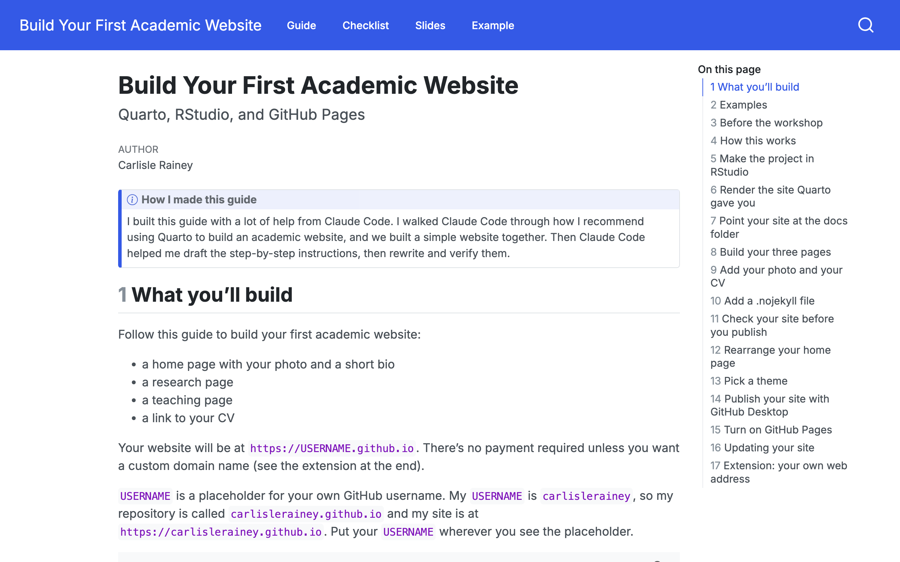
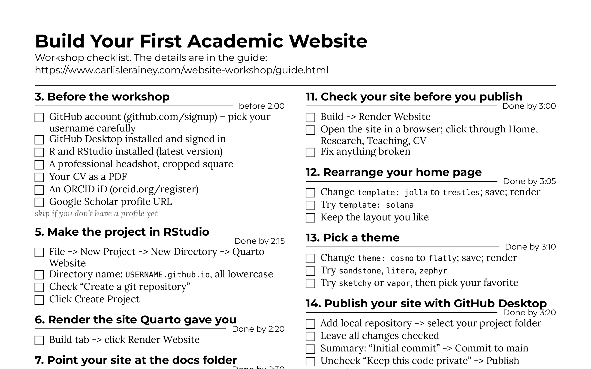
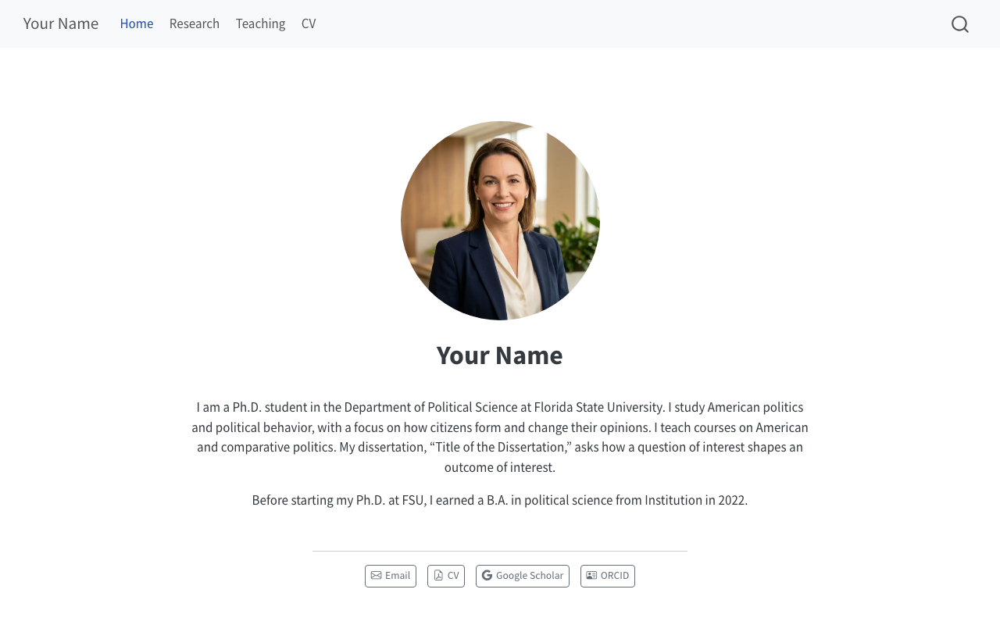
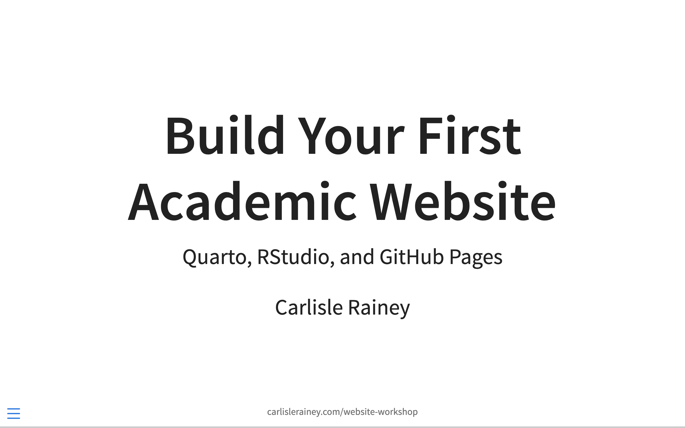

# Build Your First Academic Website

*Quarto, RStudio, and GitHub Pages*

A workshop for PhD students.

**Goal:** in 90 minutes, build a home page with your photo and bio, a research page, a teaching page, and your CV, and publish it at `USERNAME.github.io`.

|  |  |
|:---|:---|
| **[The guide](https://www.carlislerainey.com/website-workshop/guide.html)** | **[The checklist](https://www.carlislerainey.com/website-workshop/checklist/checklist.pdf)** |
| To follow during the workshop. | One page. Print it and tick off the steps as you go. |

|  |  |
|:---|:---|
| **[The example site](https://www.carlislerainey.com/website-workshop/example/)** | **[The slides](https://www.carlislerainey.com/website-workshop/slides.html)** |
| The site the guide builds. Click around. | To put on the screen during the workshop. |

---

**Issues.** If you find something here that is wrong, unclear, incomplete, or missing, [open an issue](https://github.com/carlislerainey/website-workshop/issues) on GitHub. I'd love ideas for improving the workshop, as well.
