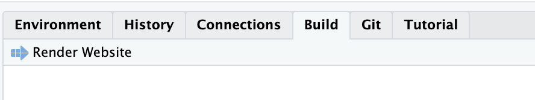
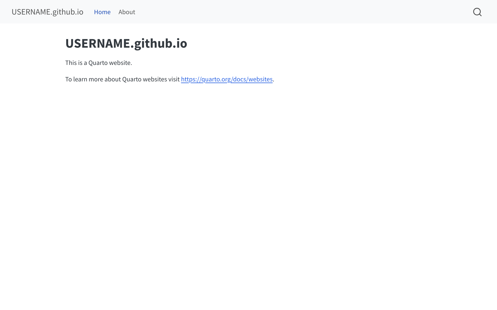
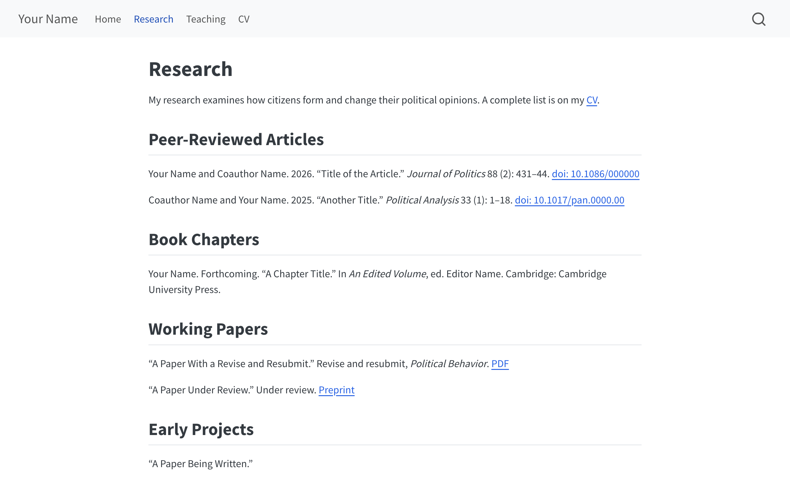
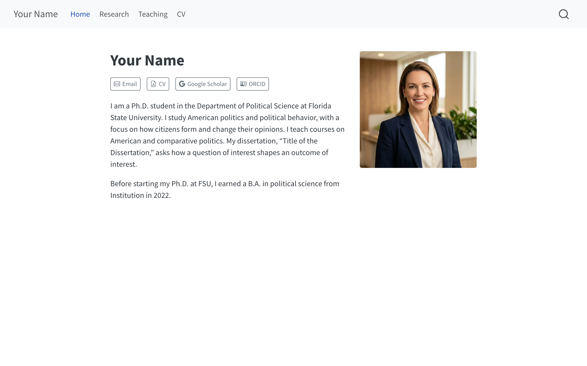
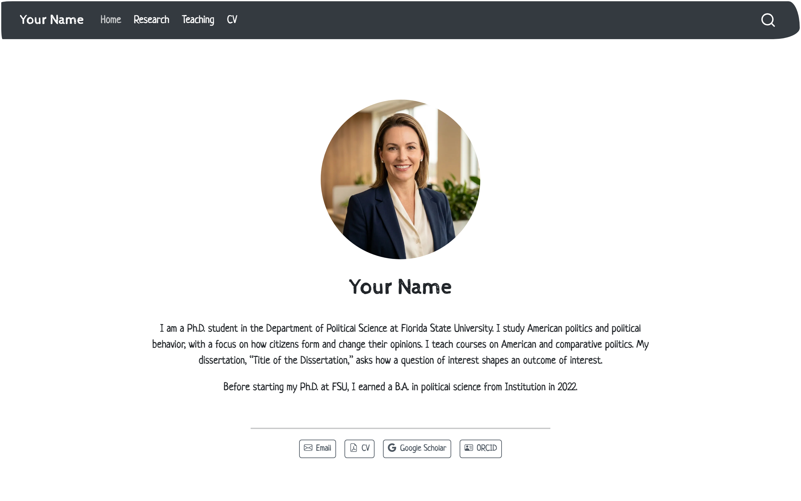
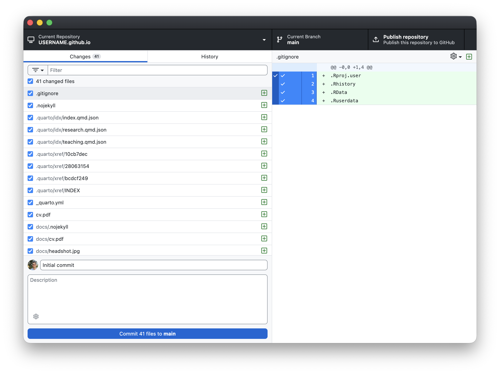
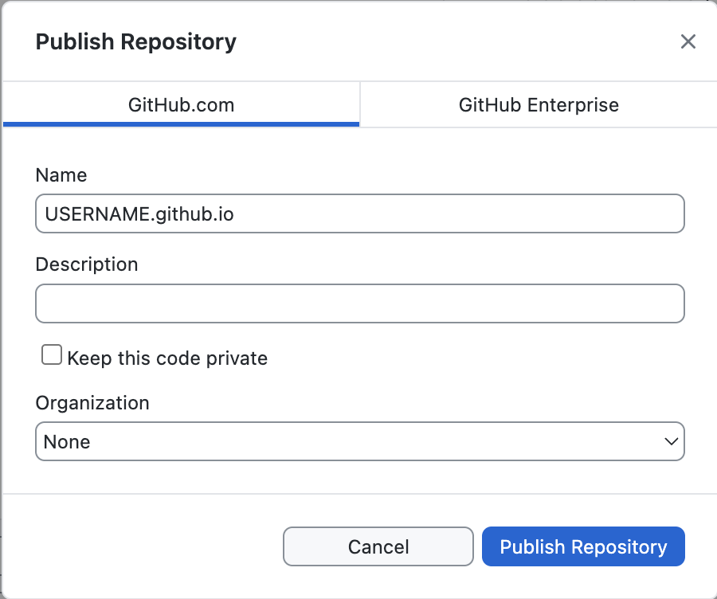
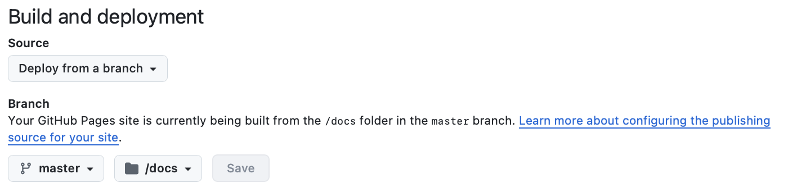

## What's your goal? {.center}

::: {style="color: #6c757d; font-size: 0.65em;"}
(the content and design follow from there) <!-- deck only -->
:::

## What you'll build

Follow this guide to build your first academic website:

- a home page with your photo and a short bio
- a research page
- a teaching page
- your CV

Your website will be at `https://USERNAME.github.io`. There's no payment required unless you want a custom domain name (see the extension at the end).

## What you'll build

`USERNAME` is a placeholder for your own GitHub username. My `USERNAME` is `carlislerainey`, so my repository is called `carlislerainey.github.io` and my site is at `https://carlislerainey.github.io`. Put your `USERNAME` wherever you see the placeholder.

## What you'll build


## Examples {.smaller}

These three are pretty close to what you'll have after you finish this guide:

- [Artur Baranov](https://artur-baranov.github.io/), a PhD candidate at Northwestern, uses `jolla`, the centered layout we start from. [Source](https://github.com/artur-baranov/artur-baranov.github.io) is on GitHub.
- [Maranda Joyce](https://marandaljoyce.github.io/), a PhD candidate at Rice, uses `trestles` and one of Quarto's dark themes. [Source](https://github.com/marandaljoyce/marandaljoyce.github.io) is on GitHub.
- [Tyler Rongxuan Chen](https://tylerrongxuanchen.github.io/), a PhD candidate at Michigan, uses `solana` and almost the same row of buttons you will make. [Source](https://github.com/tylerrongxuanchen/tylerrongxuanchen.github.io) is on GitHub.

These two have a bit of customization.

- [Charlotte Kuberka](https://charlottekuberka.github.io/), a PhD candidate at LSE, kept `trestles` and restyled it to match her CV. [Source](https://github.com/charlottekuberka/charlottekuberka.github.io) is on GitHub.
- [Frederik Hjorth](https://fghjorth.github.io/), a professor at Copenhagen, has a page each for his papers, his teaching, and his data. [Source](https://github.com/fghjorth/fghjorth.github.io) is on GitHub.

## Examples {.smaller}

Four more sites show what a Quarto site can grow into.

- [Chad Hazlett](https://chadhazlett.com/), a professor at UCLA, adds a publications page and a software page to the three pages you will build. [Source](https://github.com/chadhazlett/chadhazlett.github.io) is on GitHub.
- [Christopher Kenny](https://christophertkenny.com/), a postdoc at Princeton, adds software, a blog, and a page for the Quarto extensions he writes. [Source](https://github.com/christopherkenny/christopherkenny.github.io) is on GitHub.
- [Frederick Solt](https://fsolt.org/), a professor at Iowa, has about 180 pages: a blog, software, and a site for each of his data projects. [Source](https://github.com/fsolt/fsolt.github.io) is on GitHub.
- [Rob Hyndman](https://robjhyndman.com/), a professor of statistics at Monash, has nearly 900 pages: a blog, publications, software, seminars, and teaching. [Source](https://github.com/robjhyndman/robjhyndman.com) is on GitHub, though he hosts the site on his own server.

## Before the workshop {.smaller}

Here's what you should do *before* the workshop. Most of you should already have most of these.

- [ ] **A GitHub account.** Sign up free at [github.com/signup](https://github.com/signup). Choose the username carefully, because it becomes your web address. `johnasmith` gives the site `johnasmith.github.io`. Use your name, all lowercase, nothing tied to FSU, and no gamer tags. [Happy Git with R](https://happygitwithr.com/github-acct) has good advice on picking one. If your existing username would look odd on a CV, [change it](https://docs.github.com/en/account-and-profile/how-tos/account-management/changing-your-username) before the workshop.

- [ ] **GitHub Desktop**. Install from [desktop.github.com](https://desktop.github.com). Make sure to get [signed in](https://docs.github.com/en/desktop/installing-and-authenticating-to-github-desktop/authenticating-to-github-in-github-desktop) to your account (**GitHub Desktop → Settings → Accounts** on a Mac, **File → Options → Accounts** on Windows).

## Before the workshop {.smaller}

- [ ] **R and RStudio**. Install the latest version from [posit.co](https://posit.co/download/rstudio-desktop/). Any version since 2025 or so works, too. Quarto comes built into RStudio. Check **RStudio → About RStudio** if you aren't sure.

- [ ] **A professional headshot**, cropped square.

- [ ] **Your CV** as a PDF.

- [ ] **An ORCID iD**. Register for free at [orcid.org/register](https://orcid.org/register).

- [ ] **Your Google Scholar profile URL**. Only if you have [a profile](https://scholar.google.com/intl/en/scholar/citations.html). No profile yet is fine.

## How this works

1. We write our pages as plain text files.
2. We use [Quarto](https://quarto.org/docs/websites/) to turn them into a website in a folder called `docs/`, which makes [GitHub Pages](https://quarto.org/docs/publishing/github-pages.html) simple.
3. We use GitHub Desktop to send that folder to GitHub (and GitHub Pages serves it to the world).

## Make the project in RStudio {.smaller}

*Done by 2:15.*

In RStudio, click **File → New Project… → New Directory → Quarto Website**. Fill in the pane that follows.

- **Directory name:** `USERNAME.github.io`, all lowercase. This exact name puts your site at `https://USERNAME.github.io`. If you use any other name, your site will be at `USERNAME.github.io/that-other-name/`.
- **Create project as subdirectory of:** somewhere you will find it again. I keep my website in `Dropbox/`, but git and Dropbox don't always play nicely.
- **Engine:** leave it as it is.
- Check **Create a git repository**. You'll need the git repo for GitHub Desktop later.
- Leave **Use renv with this project** unchecked.

Click **Create Project**. RStudio reopens with your new project loaded.

## Render the site Quarto gave you {.smaller}

*Done by 2:20.*

Quarto has already added a working website. Before we change anything, look at what it added.

In the **Files** pane (bottom right) you will find four files:

| File | What it is |
|---|---|
| `_quarto.yml` | The settings for your whole site: title, navigation bar, theme. |
| `index.qmd` | Your home page. |
| `about.qmd` | A second page, included as an example. |
| `styles.css` | An empty file for custom styling. |

## Render the site Quarto gave you

Render your website. Go to the **Build** tab (top right) and click **Render Website**. Your website will appear in the Viewer pane.



## Render the site Quarto gave you

You will also see a new folder in the Files pane called `_site`. That's where Quarto put the finished website. It's the default spot; you will move it to a new location in the next section.



## Point your site at the docs folder {.smaller}

*Done by 2:30.*

Open `_quarto.yml` from the Files pane, select everything in it, delete it, and replace it with this:

The full block is in the guide, section 7. <!-- abridged -->

We changed five things away from the Quarto default:

1. **`output-dir: docs`** sends the finished site to `docs/` instead of `_site/`. GitHub Pages will serve a folder named `docs` (but not one called `_site/`).
2. **`title:`** is your name.
3. **The navbar** lists Research, Teaching, and your CV instead of the example "about" page.
4. **`theme: cosmo`** replaces a two-item list. The `brand` entry it came with uses a `_brand.yml` file of custom colors and fonts, which you don't have.
5. **`toc: true`** is deleted, because a table of contents on a webpage is usually clutter.

## Point your site at the docs folder

`css: styles.css` stays. The file is empty and we won't add anything today. Your own CSS rules can go there later.

::: {.callout-warning}
YAML is particular about spaces. The spaces create the indentation that gives the file its structure. Keep the spaces exactly as they appear above. Use spaces rather than tabs.
:::

Delete the `_site` folder you made a moment ago. Check the box beside it in the Files pane and click **Delete**. We won't need it again.

## Build your three pages

*Done by 2:50.*

Start by deleting the example page we don't need. Check `about.qmd` in the Files pane, then click **Delete**.

**Your home page.** Open `index.qmd`, select everything, and replace it with Quarto syntax below. Put in your own name, bio, email address, Scholar URL, and ORCID iD:

The full block is in the guide, section 8. <!-- abridged -->

## Build your three pages

If you don't have a Google Scholar profile yet, delete its three lines. Google Scholar is only important once you accumulate citations.

```
    - icon: google
      text: Google Scholar
      href: https://scholar.google.com/citations?user=XXXXXXXXXXXX
```

To add another button (e.g., GitHub, LinkedIn), copy the three-line pattern and pick an [icon name](https://icons.getbootstrap.com/).

## Build your three pages

**Your research page.** Click **File → New File → Text File**, paste the block below, then choose **File → Save As…** and name it exactly `research.qmd`:

The full block is in the guide, section 8. <!-- abridged -->

Replace the placeholder material with your own.

**Your teaching page.** Click **File → New File → Text File**, paste the block below, then choose **File → Save As…** and name it exactly `teaching.qmd`:

The full block is in the guide, section 8. <!-- abridged -->

Replace the placeholder material with your own.

## Build your three pages

The rendered research page looks like this, with the sample content in it:

{width="52%"}

## Add your photo and your CV {.smaller}

*Done by 2:55.*

Your headshot and your CV are files rather than text. Find them in Finder (on a Mac) or File Explorer (on Windows). Right-click and copy these files (together or one at a time). In RStudio, go to the Files pane and choose **More → Show Folder in New Window**. You'll see your project folder open in a new window, with `_quarto.yml` and your `.qmd` files already in it.

Paste both files in. Rename them exactly:

- `headshot.jpg`
- `cv.pdf`

## Add your photo and your CV

::: {.callout-tip}
## Any PDF works the same way

A working paper, a syllabus, and conference slides would work the same way. Drop the file into the project folder, link it from any page (e.g., `[PDF](smith-turnout-2026.pdf)` on your research page), and render. Quarto copies every file your pages link to into `docs/`, so the link will work on the live site with no upload step.
:::

## Add a .nojekyll file

Click into the **Console** at the bottom left and run:

```r
file.create(".nojekyll")
```

It prints `TRUE` and creates an empty file.

Without this strange file, GitHub Pages will run your folder through a blog engine called Jekyll. We don't want to do that because we're rendering locally. The empty `.nojekyll` file turns that off. Quarto's documentation recommends this.

## Check your site before you publish {.smaller}

*Done by 3:00.*

Go to **Build → Render Website** once more.

Then click the arrow at the top of the Viewer pane to open your site in a real browser. Before we publish it to GitHub, click through everything in the navigation bar:

- [ ] **Home** shows your photo, your bio, and four working buttons.
- [ ] **Research** and **Teaching** show your own content.
- [ ] **CV** opens your PDF.

Fix anything broken.

## Rearrange your home page {.smaller}

*Done by 3:05.*

Quarto has five layout templates that you can use for your homepage (i.e., `index.qmd`). You can change it with the `template:` option.

| Layout | Arrangement |
|---|---|
| `jolla` | Photo at the top, centered, with your name, bio, and buttons below it. |
| `trestles` | Photo and buttons in a left column, bio on the right. |
| `solana` | Name, buttons, and bio on the left, photo on the right. |
| `marquee` | One large image across the top, everything else stacked below. |
| `broadside` | Photo on the left, name, bio, and buttons on the right. |

## Rearrange your home page

1. Open `index.qmd` and change `template: jolla` to `template: trestles`. Save, then click **Render Website**. Look for the changes.
2. Try `template: solana` next.
3. Keep the one you like. The screenshots in the rest of this guide use `jolla`.

## Rearrange your home page

::: {layout-ncol=2}



:::

`marquee` uses a wide banner image, not a square headshot. Pictures of all five layouts are in the [Quarto documentation](https://quarto.org/docs/websites/website-about.html).

## Pick a theme {.smaller}

*Done by 3:10.*

You can change the overall look of your site with the `theme:` option. Quarto has [25 themes](https://quarto.org/docs/output-formats/html-themes.html) you can choose from.

1. Open `_quarto.yml` and change `theme: cosmo` to `theme: flatly`. Save and render. Notice the change.
2. Try `sandstone`, `litera`, and `zephyr`. All four are professional choices appropriate for an academic site, so pick whichever you like. You can see full-size previews of all 25 at [bootswatch.com](https://bootswatch.com/).

## Pick a theme

::: {layout-ncol=2}


:::

## Pick a theme

::: {layout-ncol=2}


:::

## Pick a theme {.smaller}

3. Just for fun, try `sketchy` and/or `vapor`. (Then change back to your favorite.)

::: {layout-ncol=2}



:::

## Publish your site with GitHub Desktop {.smaller}

*Done by 3:20.*

Open **GitHub Desktop**.

1. Click **File → Add local repository…**, click **Choose…**, and select your `USERNAME.github.io` folder. Then click **Add repository**.
2. Your files will be listed under the **Changes** tab. There will be a lot of them. You need them all, so leave everything checked.
3. At the bottom left, type `Initial commit` in the **Summary** box. Then click **Commit to main**. (Your button may say `master` instead; remember which one it says.)
4. At the top of the window, click **Publish repository**.

## Publish your site with GitHub Desktop {.smaller}

{width="42%"}

::: {.callout-important}
Uncheck **Keep this code private** before you publish. With a free account, GitHub Pages only works for *public* repositories.
:::

## Publish your site with GitHub Desktop {.smaller}

{width="46%"}

Click **Publish repository**. Your new repository will appear on github.com in a few seconds.

## Turn on GitHub Pages {.smaller}

*Live by 3:30.*

On github.com, open your new repository and update [the settings](https://docs.github.com/en/pages/getting-started-with-github-pages/configuring-a-publishing-source-for-your-github-pages-site):

1. Click **Settings** at the top, then **Pages** down the left side.
2. Under **Build and deployment**, set **Source** to **Deploy from a branch**.
3. Set **Branch** to `main` (or to `master` if that is what your commit button said) and set the folder beside it to **`/docs`**. Click **Save**.
4. Wait about two minutes, then visit `https://USERNAME.github.io`. GitHub documentation says this can take up to ten minutes.

## Turn on GitHub Pages {.smaller}

{width="46%"}

## Updating your site

To update your site:

1. Edit the `.qmd` file in RStudio. Save it.
2. Click **Build → Render Website**.
3. In GitHub Desktop, write a short summary, click **Commit to main**, then click **Push origin**.

These updates will appear on your live site about two minutes later (but can take longer).

## Extension: your own web address {.smaller}

`USERNAME.github.io` is free and perfectly reasonable. A custom domain like `johnasmith.com` costs about $15 a year and looks a little more polished.

**Choosing the name.** Your name makes the best address.

- `johnasmith.com` is the best.
- `jasmith.com`, `johnsmith.io`, and `jsmith.co` are good also.
- Skip hyphens, digits, and anything that ties you to a place or a field. `johnsmithfsupolitical.science` is a poor choice.

Try names in [Domainr](https://domainr.com/?q=). It checks many related domain names at once and shows which ones are available. (But don't buy it from Domainr.)

## Extension: your own web address {.smaller}

**Buying it.** Search for the name on Namecheap, add it to the cart, and check out. A `.com` domain name costs about $10 the first year and about $15 a year after that. Accept the free WHOIS protection; decline the other add-ons.

**Connecting it.**

1. On Namecheap, click **Domain List → Manage → Advanced DNS**.
   a. Delete any records already in the list. A new domain might have a www CNAME pointing at Namecheap's parking page and a URL Redirect on @. Remove these; both conflict with the records below.
   b. Add five records (i.e., the five that [Namecheap's own GitHub Pages guide](https://www.namecheap.com/support/knowledgebase/article.aspx/9645/2208/how-do-i-link-my-domain-to-github-pages/) describes):

| Type | Host | Value |
|---|---|---|
| A Record | `@` | `185.199.108.153` |
| A Record | `@` | `185.199.109.153` |
| A Record | `@` | `185.199.110.153` |
| A Record | `@` | `185.199.111.153` |
| CNAME Record | `www` | `USERNAME.github.io` |

## Extension: your own web address {.smaller}

2. In the RStudio console, run `writeLines("johnasmith.com", "CNAME")` (replace your own domain in the quotes). This creates a file named `CNAME` that has just the domain. Quarto copies it into `docs/` on every render, which is how GitHub knows the domain belongs to this site. Render, commit, push.
3. In your repository on github.com, click **Settings → Pages**, type `johnasmith.com` into [**Custom domain**](https://docs.github.com/en/pages/configuring-a-custom-domain-for-your-github-pages-site/managing-a-custom-domain-for-your-github-pages-site), and click **Save**. GitHub checks your DNS records, which usually takes minutes but can take up to a day. When the check passes, check **Enforce HTTPS**. GitHub documentation says the box can take up to a day to become clickable. Once you check it, the certificate usually arrives within a few minutes. If it doesn't, remove the custom domain, add it again, and click **Save**. (If GitHub Desktop offers **Pull origin** afterward, click it; GitHub sometimes adds a small commit of its own when you save the domain.)

Your site is now live at the new address; the old `USERNAME.github.io` address keeps working as well.
